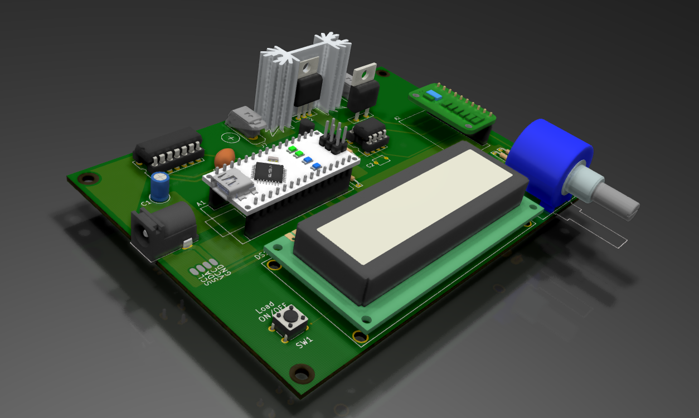
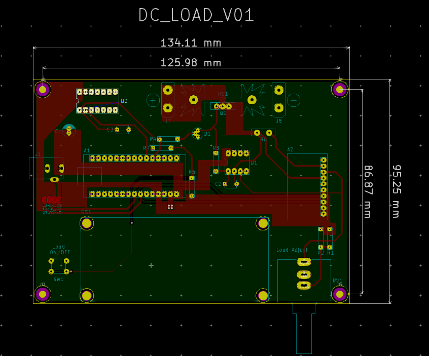

# DC_LOAD_V01

### Summary: ###
  This is a functional PCB prototype of a 1-amp constant current DC load
  which will precede a much stronger 5-amp load in the future. This
  tool can be used for testing batteries and other power sources <= 1 amp.
  
  The BOM, schematic PDF, and gerber files are all accessible in the _'Outputs/'_ folder. 
  Other project files are not included because they add clutter and can be generated from the project itself in KiCad.
  Thanks.
  
  
